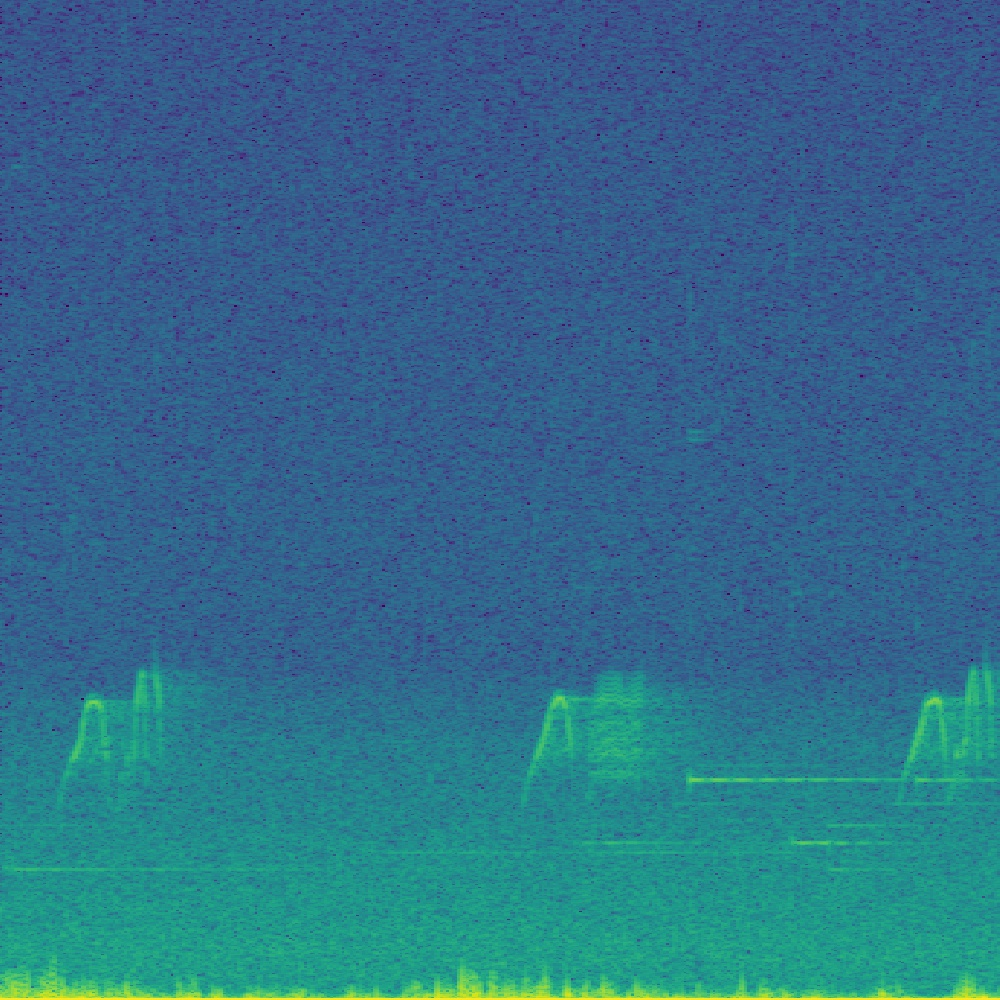

# WildlifeAudioStreamSampler
Wildlife Audio Stream Sampler is a proof of concept(PoC) for a power over ethernet (PoE) streaming microphone. While this is intended for acoustic monitoring of wildlife, the server code can be deployed on any devices with a microphone.


## Hardware
The PoC was developed with: 
* Raspberry PI 3 Model B+
* [Adafruit I2S MEMS Micophone](https://www.adafruit.com/product/3421)
* PoE Splitter with MicroUSB, also available from [Adafruit](https://www.adafruit.com/product/3785)

## Setup and Install
There are detailed setup instruction on the Adafruit site for connecting the microphone to a Raspberry PI

Before setting up a Python virtual environment a couple of extra dependencies are needed on the PI.
```bash
sudo apt-get install libportaudio0 libportaudio2 libportaudiocpp0 portaudio19-dev

# Note: If you just setting up the server to test on a regular Linux machine libportaudio0 should not be needed.
```


```bash
python3 -m venv audio
source audio/bin/activate
python -m pip install pip --upgrade
python -m pip install pyaudio

python server.py
```

To set up a virtual environment on the client,
```bash
python3 -m venv audio
source audio/bin/activate
python -m pip install pip --upgrade
python -m pip install librosa
python -m pip install matplotlib

# Update sampling parameters in the client.py file as needed
python client.py [PI IP]
```
The default setting will request 60 seconds of audio every 5 minutes. The audio is broken into 4 seconds samples with 2 seconds of overlap between samples. 

